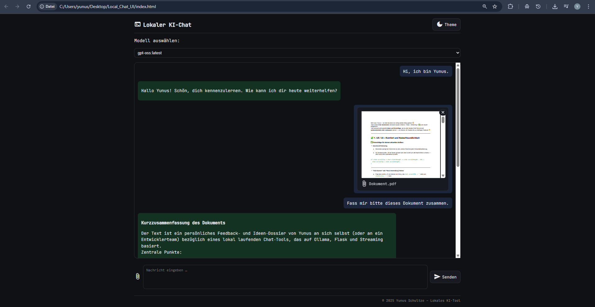
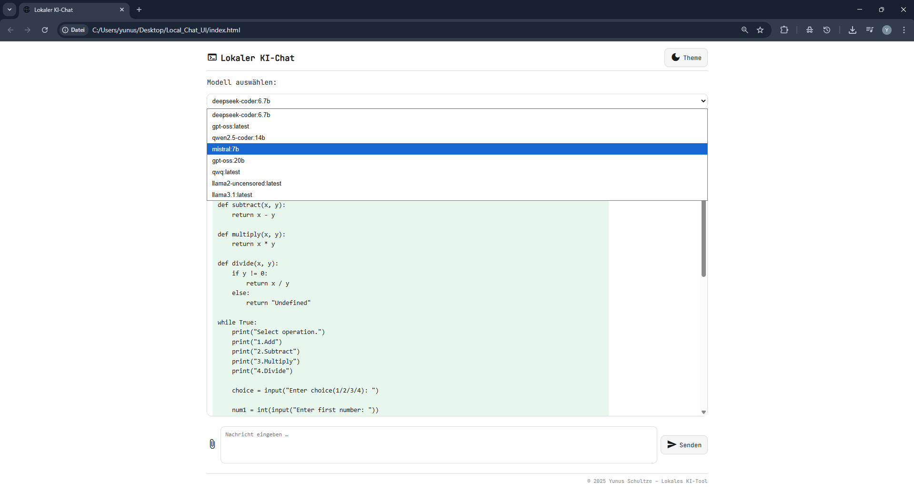

# 💻 OllamaDesk – Chatbot über eigene GPU (Flask + Ollama)

Ein vollständig **lokaler KI-Chatbot**, der **über die eigene Grafikkarte (GPU)** läuft – kein API-Key, keine Cloud.  
Er kombiniert eine minimalistische Weboberfläche mit **Ollama** als Backend, um große Sprachmodelle wie **LLaMA 3** oder **Mistral** direkt **offline auf dem eigenen Rechner** auszuführen.

---
## 🖥️ Demo

**Darkmode**



---

**Lightmode + Modellauswahl**



---

## 🚀 Funktionen

-  **Chat mit lokalem KI-Modell (Ollama)**
-  **Läuft vollständig auf der eigenen GPU / CPU**  
  → keine Internetverbindung oder Cloud-Abhängigkeit
-  **PDF Datei-Upload** mit automatischer Textextraktion  
-  **Echtzeit-Streaming** der Antworten (Zeichenweise wie bei ChatGPT)  
-  **Dark-/Lightmode** mit Themespeicherung  
-  **100 % lokal & datensicher**
-  **Markdown-Unterstützung** (Codeblöcke, Listen, Formatierungen)

---

## 🛠️ Tech Stack

| Bereich | Technologien |
|----------|---------------|
| **Frontend** | HTML, CSS, Vanilla JS, marked.js, Material Icons |
| **Backend** | Python, Flask, Flask-CORS, Requests, PyPDF2 |
| **KI-Engine** | Ollama (lokal auf GPU/CPU) – z. B. LLaMA 3, deepseek-coder, gpt-oss |
---

## ⚙️ Installation & Setup

1. **Ollama installieren** → https://ollama.com/download  

2. **Modell laden** (Beispiel):
   ```bash
   ollama run gpt-oss:20b

   # Bibliothek für weitere Modelle: https://ollama.com/library

   # Modelle anzeigen lassen mit ollama list
NAME                        ID              SIZE      MODIFIED
deepseek-coder:6.7b         ce298d984115    3.8 GB    4 hours ago
gpt-oss:latest              17052f91a42e    13 GB     4 hours ago
qwen2.5-coder:14b           9ec8897f747e    9.0 GB    4 hours ago
mistral:7b                  6577803aa9a0    4.4 GB    4 hours ago
gpt-oss:20b                 17052f91a42e    13 GB     5 hours ago
qwq:latest                  009cb3f08d74    19 GB     26 hours ago
llama2-uncensored:latest    44040b922233    3.8 GB    28 hours ago
llama3.1:latest             46e0c10c039e    4.9 GB    29 hours ago


3. **Projekt starten**
   ```bash
    # Repository klonen
    git clone https://github.com/xyunuss/local-ai-chat

    # Abhängigkeiten
    pip install flask flask-cors requests PyPDF2

    # Backend starten
    python server.py

    # Benutzen
    index.html im Browser öffnen

---

## 📜 Lizenz

Veröffentlicht unter der MIT License
© 2025 Yunus Yakup Peter Schultze