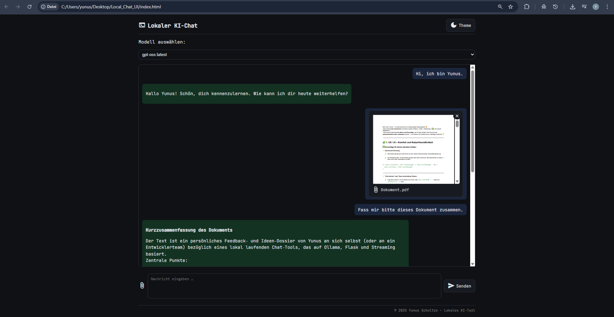
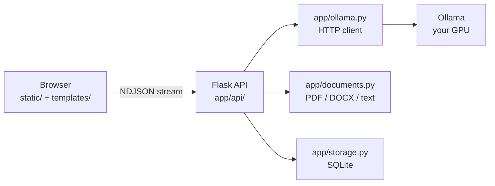

# Local AI Chat

A chat interface for [Ollama](https://ollama.com) that runs entirely on your own
machine. No cloud, no API key, no account — the model, the conversations and the
documents you attach never leave your computer.

[](https://github.com/xyunuss/local-ai-chat/actions/workflows/ci.yml)


*[Deutsche Kurzfassung ↓](#kurzfassung-deutsch)*

---



## What it does

- **Streams answers token by token**, with the model's own timings — tokens/s,
  token counts and total time under every reply
- **Keeps your conversations**, in a searchable sidebar. They live in a SQLite
  file you can delete at any time
- **Reads documents**: PDF, DOCX and around 50 text and code formats, by drag
  and drop or paste. It tells you what it actually extracted (pages, characters,
  whether it had to truncate) before anything is sent to a model
- **Stop, regenerate, edit** — interrupt a running answer and keep what arrived,
  ask for another attempt, or rewrite an earlier turn and continue from there
- **Per-conversation system prompt** and sampling parameters
- **Downloads models** from the interface, with a progress bar
- **Exports** any conversation as Markdown
- **Works offline.** Every dependency is served locally, including the markdown
  parser and syntax highlighter. Unplug the network and nothing changes

## Quick start

You need [Ollama](https://ollama.com/download) and Python 3.10+.

```bash
# 1. a model, if you have none yet
ollama pull llama3.2:3b

# 2. the app
git clone https://github.com/xyunuss/local-ai-chat
cd local-ai-chat
pip install -r requirements.txt
python run.py
```

Open <http://localhost:5000>.

### With Docker

```bash
docker compose up --build
```

Ollama stays on the host, where it can reach the GPU; the container talks to it
over `OLLAMA_URL`.

## How it fits together


```mermaid
flowchart LR
    UI["Browser<br/>static/ + templates/"]
    API["Flask API<br/>app/api/"]
    OL["app/ollama.py<br/>HTTP client"]
    DOC["app/documents.py<br/>PDF / DOCX / text"]
    DB["app/storage.py<br/>SQLite"]
    OLLAMA["Ollama<br/>your GPU"]

    UI -- "NDJSON stream" --> API
    API --> OL --> OLLAMA
    API --> DOC
    API --> DB
```

Responses are **newline-delimited JSON**, not raw text, so a single stream can
carry tokens, an end marker with timings, and errors that happen mid-generation:

```jsonc
{"type": "start", "conversationId": "a1b2…", "title": "Explain WAL mode"}
{"type": "token", "content": "SQLite "}
{"type": "done",  "messageId": 42, "stats": {"tokensPerSecond": 38.4, "completionTokens": 210}}
```

### API

| Method | Path | Purpose |
| --- | --- | --- |
| `GET` | `/api/health` | App status and whether Ollama is reachable |
| `GET` | `/api/models` | Installed models with size and quantization |
| `POST` | `/api/models/pull` | Download a model, streams progress |
| `GET` | `/api/models/<name>` | What Ollama knows about a model |
| `POST` | `/api/chat` | Generate, streams NDJSON |
| `POST` | `/api/documents` | Extract text from uploads |
| `GET/POST` | `/api/conversations` | List, search, create |
| `GET/PATCH/DELETE` | `/api/conversations/<id>` | Read, rename, delete |
| `GET` | `/api/conversations/<id>/export` | Markdown or JSON |

`/api/chat` also works statelessly — send `messages` instead of a
`conversationId` and nothing is persisted, which makes it easy to script
against:

```bash
curl -N localhost:5000/api/chat -H 'Content-Type: application/json' \
  -d '{"model":"llama3.2:3b","messages":[{"role":"user","content":"Say hi"}]}'
```

## Configuration

Every setting is an environment variable with a working default.

| Variable | Default | Meaning |
| --- | --- | --- |
| `OLLAMA_URL` | `http://localhost:11434` | Where Ollama listens — a container or another machine works too |
| `HOST` / `PORT` | `127.0.0.1` / `5000` | Where the app listens |
| `DATA_DIR` | `data` | SQLite database location |
| `MAX_UPLOAD_MB` | `20` | Upload size limit |
| `REQUEST_TIMEOUT` | `300` | Seconds to wait for a generation |
| `DEBUG` | off | Flask debug mode |

## Development

```bash
pip install -r requirements-dev.txt
pytest          # 47 tests
ruff check .
```

The test suite needs **no GPU, no model and no Ollama**: `tools/ollama_stub.py`
implements enough of the Ollama API to exercise streaming, cancellation,
timings and downloads. You can develop against it too:

```bash
python tools/ollama_stub.py --port 11434   # terminal 1
python run.py                              # terminal 2
```

Layout:

```
app/            Flask application
  api/          endpoints, one blueprint per area
  ollama.py     typed client for the Ollama HTTP API
  documents.py  text extraction
  storage.py    SQLite persistence
static/         css, js modules, vendored libraries
templates/      index.html
tools/          Ollama stub
tests/          pytest suite
```

No build step and no npm: the frontend is plain ES modules, and the two
third-party libraries it needs are checked into `static/vendor/`.

---

## Kurzfassung (Deutsch)

**Local AI Chat** ist eine Chat-Oberfläche für [Ollama](https://ollama.com), die
vollständig auf dem eigenen Rechner läuft — ohne Cloud, ohne API-Key, ohne
Account. Modelle, Gespräche und hochgeladene Dokumente verlassen den Rechner
nicht.

Wichtigste Funktionen: Antworten streamen Token für Token samt echter
Geschwindigkeitsanzeige (Tokens/s), Gespräche bleiben in einer durchsuchbaren
Seitenleiste erhalten, PDF-, DOCX- und rund 50 Text- und Code-Formate lassen sich
per Drag-and-drop anhängen, laufende Antworten können abgebrochen, neu erzeugt
oder nachträglich bearbeitet werden, System-Prompt und Sampling-Parameter sind
pro Gespräch einstellbar, und Modelle lassen sich direkt in der Oberfläche
herunterladen.

```bash
ollama pull llama3.2:3b
pip install -r requirements.txt
python run.py    # http://localhost:5000
```

---

## License

MIT — see [LICENSE](LICENSE).
© 2025 Yunus Yakup Peter Schultze
